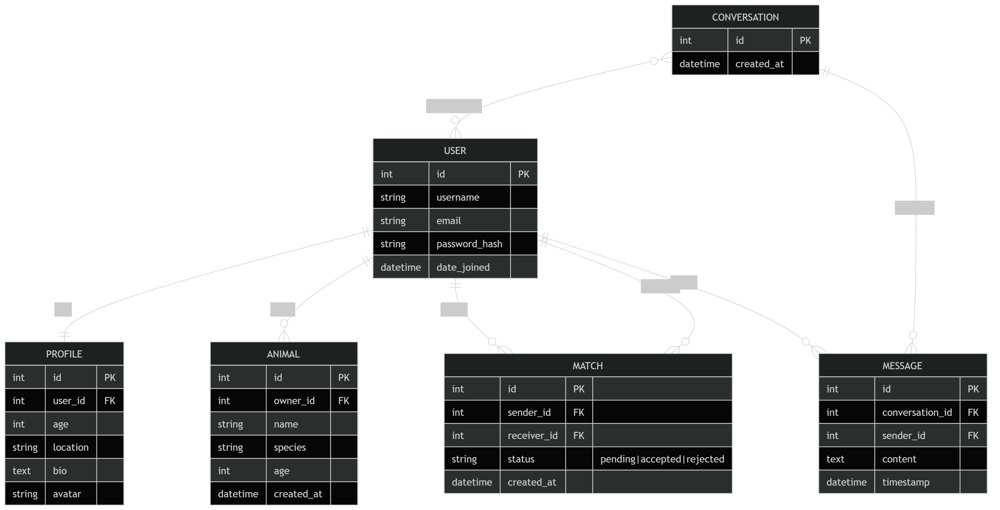
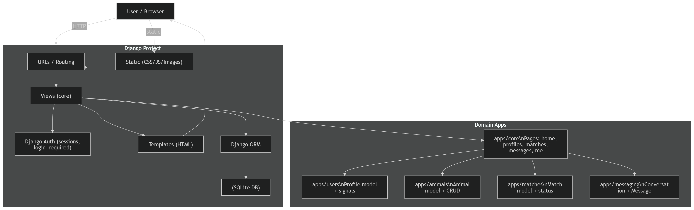
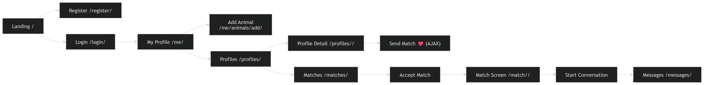

---

# 🐾 Amis des Animaux

A social matching platform designed to connect **pet owners who share a passion for animals**.

The application allows users to create profiles, add their pets, discover other pet owners, send match requests and start conversations.

This project was developed as part of the **Holberton School Portfolio Project**.

---

# 📸 Application Preview

Main features of the platform:

* User registration and login
* Profile management
* Animal management
* Profile discovery
* Match system
* Messaging system

The interface provides a **modern and intuitive experience similar to social matching platforms**.

---

# 🚀 Features

## Authentication

* User registration
* User login / logout
* Secure password hashing (Django authentication)

---

## User Profiles

Users can:

* Create their profile
* Add personal information
* Upload an avatar
* Update profile details

Profile information includes:

* Age
* Location
* Bio
* Avatar

---

## Animal Management

Each user can manage their pets.

Features include:

* Add a new animal
* Edit animal information
* Delete animal

Animal data:

* Name
* Species
* Age

---

## Matching System

Users can interact through a matching system.

Features:

* Send match requests
* Accept match requests
* Reject match requests
* Display match status

Match statuses:

* Pending
* Accepted
* Rejected

---

## Messaging System

Once two users match, they can start a conversation.

Messaging features:

* Create conversation
* Send messages
* View message history

---

# 🏗️ Application Architecture

The project follows a modular Django architecture.

```
amis-des-animaux/
├── apps/
│   ├── core/
│   ├── users/
│   ├── animals/
│   ├── matches/
│   └── messaging/
├── config/
├── templates/
│   ├── base.html
│   └── core/
├── static/
│   ├── css/
│   ├── js/
│   └── img/
├── media/
├── docs/
├── manage.py
├── requirements.txt
├── db.sqlite3
└── README.md
```

### Project Structure

- `apps/core/` : main pages, forms, context processors and template helpers
- `apps/users/` : user profile management
- `apps/animals/` : pet management
- `apps/matches/` : matching system
- `apps/messaging/` : conversations and messages
- `templates/` : Django HTML templates
- `static/` : CSS, JavaScript and images
- `media/` : uploaded user avatars
- `docs/` : project documentation and diagrams
- `config/` : Django settings and global URLs

### Apps description

| App       | Responsibility             |
| --------- | -------------------------- |
| users     | User profile management    |
| animals   | Pet management             |
| matches   | Matching system            |
| messaging | Conversations and messages |
| core      | Main views and UI logic    |

---

# 🗄️ Database Design

The database is designed using relational models.

## Main Models

### User

Django built-in authentication model.

---

### Profile

Extends the User model.

```
User
  │
  └── Profile
```

Fields:

* age
* location
* bio
* avatar

---

### Animal

Represents a user's pet.

```
User
  │
  └── Animal
```

Fields:

* name
* species
* age

---

### Match

Represents a match request between two users.

```
User ─── Match ─── User
```

Fields:

* sender
* receiver
* status
* created_at

---

### Conversation

Represents a chat conversation.

```
Conversation
  │
  └── Users
```

---

### Message

Represents a message inside a conversation.

```
Conversation
  │
  └── Message
```

Fields:

* sender
* content
* timestamp

---

# ⚙️ Technologies Used

Backend

* Python
* Django
* Django ORM

Frontend

* Django Templates
* HTML
* CSS
* JavaScript (AJAX)

Database

* SQLite (development)

Tools

* Git
* GitHub

---

# 🔒 Security

The application includes several security mechanisms:

* Django authentication system
* Password hashing
* CSRF protection
* Login required decorators
* Owner permission validation

Example:

```
get_object_or_404(Animal, owner=request.user)
```

---

# 🧪 Testing

The application was tested manually during development.

## Test cases

| Feature           | Result |
| ----------------- | ------ |
| User registration | PASS   |
| Login / logout    | PASS   |
| Profile update    | PASS   |
| Animal management | PASS   |
| Match system      | PASS   |
| Messaging system  | PASS   |

All core features function correctly.

---

# 🐞 Bug Tracking

Bug tracking documentation is available in:

```
docs/bug_tracking.md
```

The document describes:

* bugs encountered
* causes
* solutions

---

# 📊 Development Process

The project followed an iterative development process with multiple sprints.

Documentation available in:

```
docs/sprint_planning.md
docs/sprint_review.md
docs/retrospective.md
```

---
# 🔀 Git Workflow

Branching strategy:

- main
- develop
- bug

All features were developed in isolated branches and merged via Pull Requests after review.

Commit messages follow conventional format:
- feat:
- fix:
- refactor:
- docs:
---

# 🛠️ Installation

Clone the repository:

```
git clone https://github.com/EmmanuelMOUMBOUILOU/Portfolio-Project.git
```

Navigate into the project:

```
cd amis_animaux
```

Create virtual environment:

```
python3 -m venv venv
```

Activate environment:

```
source venv/bin/activate
```

Install dependencies:

```
pip install -r requirements.txt
```

Run migrations:

```
python manage.py migrate
```

Start the development server:

```
python manage.py runserver
```

Open:

```
http://127.0.0.1:8000
```

---

# 📈 Future Improvements

Possible improvements include:

* Real-time notifications
* WebSocket chat
* Geolocation matching
* Advanced search filters
* Mobile responsive improvements

---

# 🧠 Diagram

## 🗄️ Database Diagram

See the database design below:



## 📊 Application Architecture

See architecture diagram:



## 🔁 User Flow

See user flow diagram:



---

# 👨‍💻 Author

Portfolio Project developed during the **Holberton School Software Engineering Program**.

---

# 📄 License

This project was developed for educational purposes.
